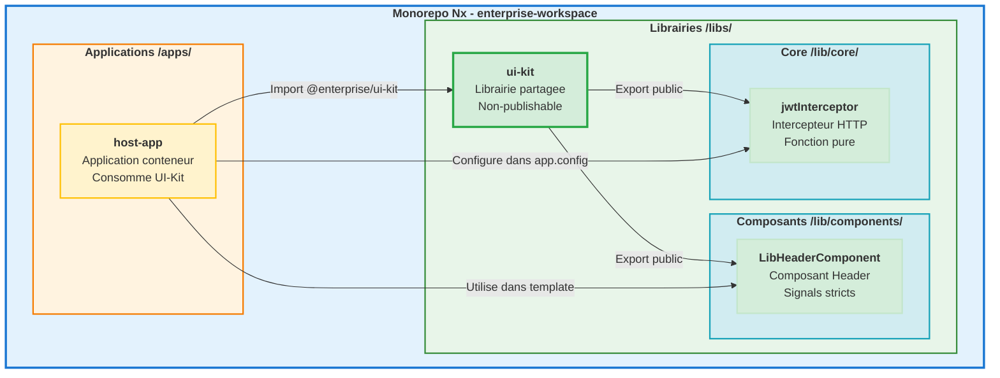
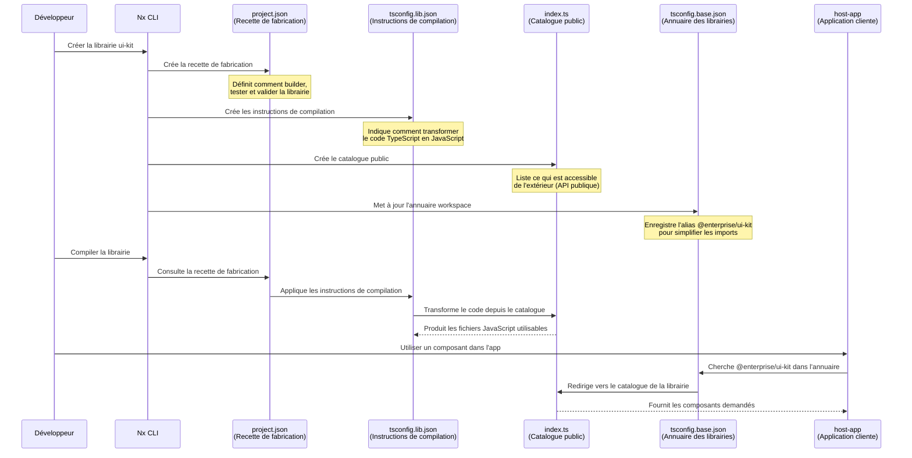
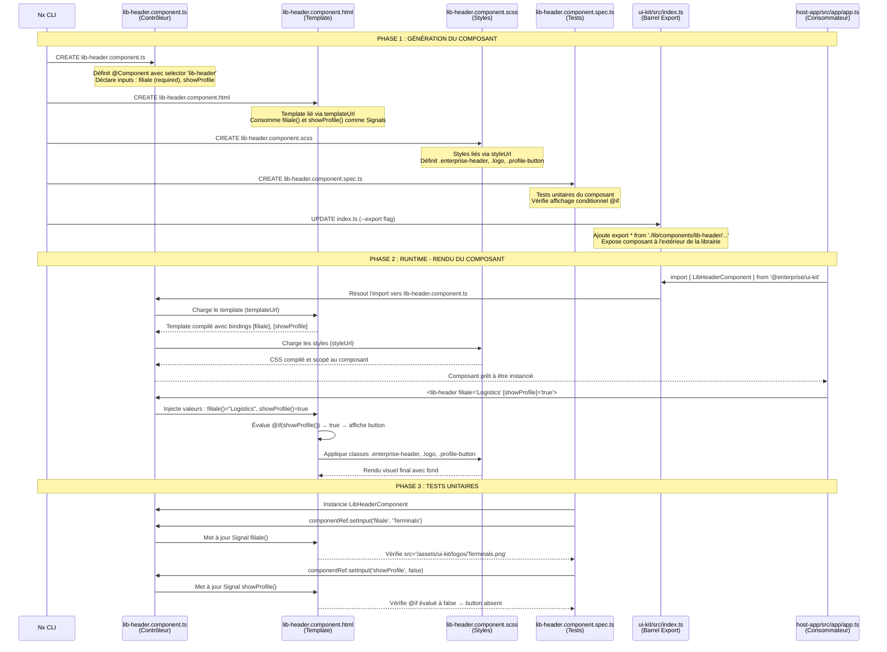
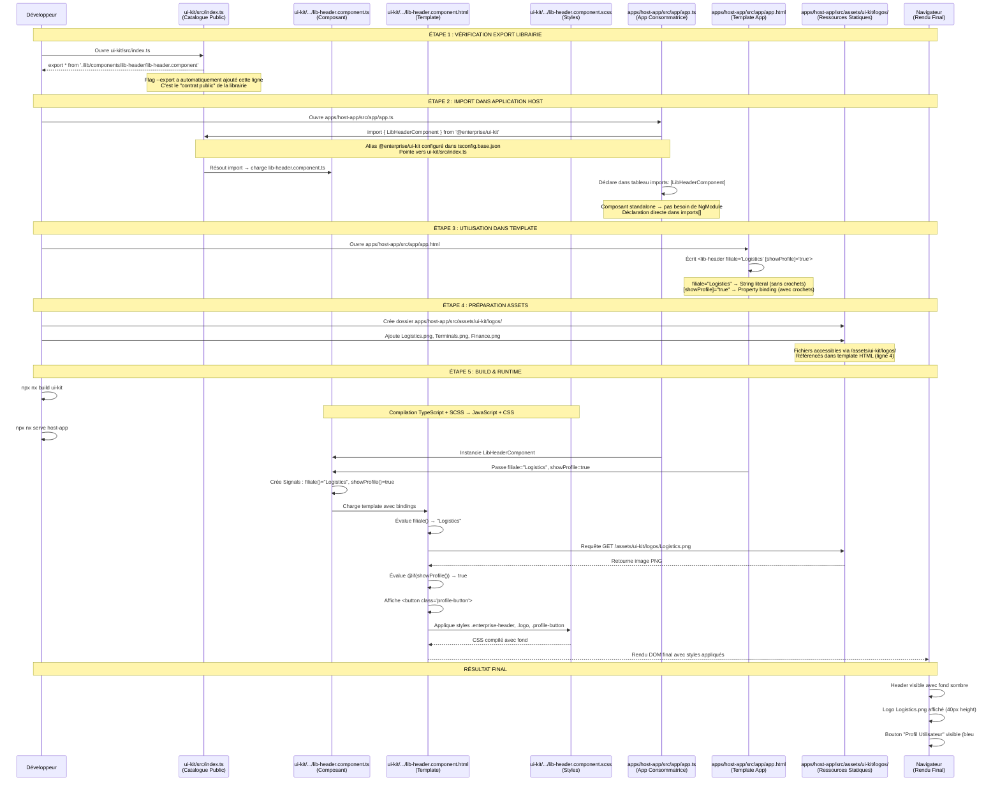
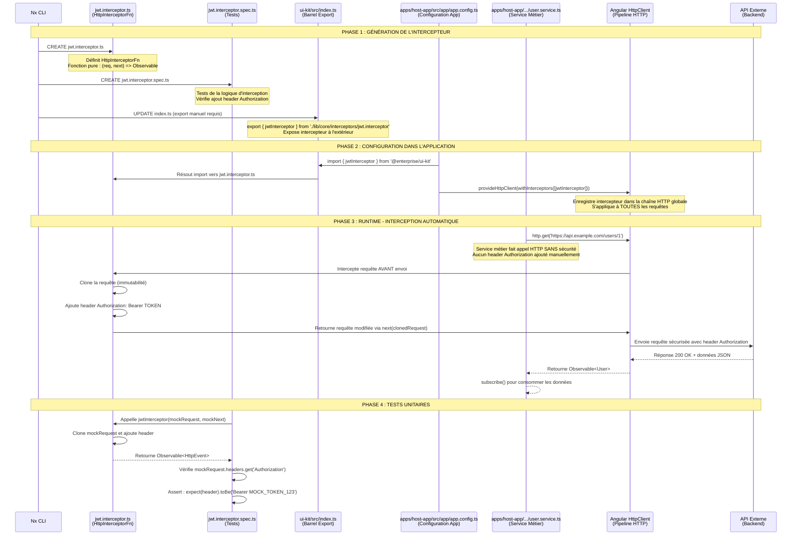

# 🎯 GOLDEN PATH - ÉTAPE 1 : BASELINE STABLE ANGULAR 18 + ESBUILD

**Version** : v1.0.0  
**Date** : 30 Mars 2026  
**Objectif** : Créer un Monorepo Nx avec Angular 18, esbuild, pnpm 10 et une librairie UI-Kit stable

---

## 🏛️ ARCHITECTURE GLOBALE DU PROJET



---

## 📋 PRÉREQUIS

Avant de commencer, vérifier que les outils suivants sont installés :

- **Node.js** : v20.x LTS minimum
- **pnpm** : v10.11.0 ou supérieur (`npm install -g pnpm@10`)
- **Git** : Pour le versioning

---

## PARTIE 1 : L'INITIALISATION STRICTE

### 1.1 - Création du Monorepo Nx

**Commande de génération (100% automatisée)** :
```bash
# Exécuter depuis le répertoire parent (ex: C:\dev\)
npx create-nx-workspace@latest enterprise-workspace `
  --preset=angular-monorepo `
  --appName=host-app `
  --style=scss `
  --bundler=esbuild `
  --packageManager=pnpm `
  --ssr=false `
  --unitTestRunner=jest `
  --e2eTestRunner=cypress `
  --nxCloud=skip

# ⚠️ Après création, NAVIGUER dans le workspace
cd enterprise-workspace
```

**Décryptage de la commande** :

```
npx create-nx-workspace@latest enterprise-workspace
│
├─ --preset=angular-monorepo
│  └─ Architecture structurée : apps et librairies séparées dans un seul repository
│     Remplace le modèle classique où chaque projet vit dans son propre repo
│
├─ --appName=host-app
│  └─ Application principale créée dans /apps/host-app/
│     Elle consommera les composants de la librairie UI-Kit
│
├─ --style=scss
│  └─ Préprocesseur CSS standard pour tout le workspace
│     Garantit l'uniformité des styles dans tous les projets
│
├─ --bundler=esbuild
│  └─ CRITIQUE : Moteur de build 10 fois plus rapide que Webpack
│     Standard Angular 17+ pour développement et production
│     NE PAS utiliser 'vite' (non supporté par le preset Angular)
│
├─ --packageManager=pnpm
│  └─ Gestionnaire strict et rapide
│     Isole les dépendances et économise l'espace disque
│
├─ --ssr=false
│  └─ Désactive Server-Side Rendering
│     Inutile pour applications internes B2B
│     Évite une question interactive
│
├─ --unitTestRunner=jest
│  └─ Framework de tests moderne
│     Remplace Karma/Jasmine obsolètes
│     Évite une question interactive
│
├─ --e2eTestRunner=cypress
│  └─ Tests end-to-end automatisés
│     Standard moderne remplaçant Protractor
│     Évite une question interactive
│
└─ --nxCloud=skip
   └─ SÉCURITÉ : Pas de cache cloud externe
      Crucial en banque/assurance : le code reste 100% local
      Évite une question interactive
```

**Note formateur** : Cette commande crée un monorepo Nx prêt pour Angular 18 en mode 100% automatisé. Chaque flag évite une question interactive, rendant la commande reproductible pour un script CI/CD. Le bundler esbuild compile 10 fois plus vite que Webpack.

**Versions stables verrouillées** :
- Angular : `~18.2.0` (toutes dépendances `@angular/*`)
- Vite : `^5.4.12`
- TypeScript : `~5.5.4` (maximum compatible Angular 18.2)
- Nx : `22.6.3` (tous packages `@nx/*` alignés)

**Point critique** : Ne jamais accepter les suggestions de mise à jour automatique vers Angular 19+ ou Vite 6+ lors de la génération.

### 1.2 - Génération de la Librairie UI-Kit

**⚠️ PRÉREQUIS CRITIQUE** : Vous devez être DANS le workspace `enterprise-workspace/` pour exécuter cette commande.

```bash
# Vérifier que vous êtes dans le bon répertoire
pwd  # Doit afficher : .../enterprise-workspace

# Si vous n'êtes pas dans le workspace, naviguer d'abord
cd enterprise-workspace

# ENSUITE générer la librairie
npx nx g @nx/angular:library `
  --name=ui-kit `
  --directory=ui-kit `
  --publishable=false `
  --importPath=@enterprise/ui-kit `
  --style=scss `
  --standalone `
  --unitTestRunner=jest
```

##### 🔍 Décryptage architectural de la librairie
```text
--name=ui-kit                 → Nom de la librairie
--directory=ui-kit            → Dossier exact (évite sous-dossiers superflus)
--publishable=false           → ⚠️ Non-publishable (Integrated Monorepo, pas de ng-packagr)
--importPath=@enterprise/ui-kit → Alias TypeScript (pas de chemins relatifs ../..)
--style=scss                  → Cohérence du préprocesseur CSS
--standalone                  → Architecture Standalone (Angular 14+)
```

**Fichiers générés par Nx** :
```
ui-kit/
├── project.json           (configuration Nx de la librairie)
├── README.md              (documentation)
├── tsconfig.json          (configuration TypeScript racine)
├── tsconfig.lib.json      (configuration build librairie)
├── tsconfig.spec.json     (configuration tests)
├── jest.config.cts        (configuration Jest)
├── eslint.config.mjs      (configuration ESLint)
└── src/
    ├── index.ts           (point d'entrée public - barrel export)
    └── test-setup.ts      (configuration environnement tests)

Fichiers workspace mis à jour :
├── tsconfig.base.json     (path mapping @enterprise/ui-kit ajouté)
└── nx.json                (configuration cache et tags)
```

#### Cycle de Vie des Fichiers de Librairie



#### Tableau des Fichiers Essentiels

| Fichier | Définition | Rôle dans le Lifecycle | Problème si Absent |
|---------|-----------|------------------------|--------------------|
| **project.json** | Configuration Nx du projet | Définit les targets (build, test, lint) et leurs options. Nx l'utilise pour orchestrer les tâches. | Nx ne peut pas builder/tester la librairie. Erreur : "Project not found". |
| **tsconfig.lib.json** | Config TypeScript pour build | Hérite de tsconfig.json. Configure la compilation de la librairie (outDir, exclude tests). | Build échoue. TypeScript ne sait pas quels fichiers compiler ni où générer les .js. |
| **src/index.ts** | Point d'entrée public (Barrel) | Exporte l'API publique de la librairie. Contrôle ce qui est accessible de l'extérieur. | Erreur d'import dans host-app : "Module not found". Librairie inutilisable. |
| **tsconfig.base.json** | Path mapping workspace | Mappe l'alias @enterprise/ui-kit vers ui-kit/src/index.ts. Utilisé par TS et IDE. | Import échoue : "Cannot find module '@enterprise/ui-kit'". Pas d'autocomplétion IDE. |
| **tsconfig.spec.json** | Config TypeScript tests | Configure la compilation des fichiers .spec.ts pour Jest. | Tests ne compilent pas. Jest ne peut pas exécuter les tests TypeScript. |
| **jest.config.cts** | Configuration Jest | Définit l'environnement de test (preset Angular, transforms, coverage). | Tests échouent : "No tests found" ou erreurs de transformation TS vers JS. |

**Note formateur** : Ces fichiers forment un écosystème cohérent. project.json orchestre, tsconfig compile, index.ts expose. Supprimer un seul fichier casse la chaîne.

### 1.3 - Le Verrouillage Architectural (Matrice de Compatibilité)

En entreprise, on ne subit pas les mises à jour, on les contrôle. Pour garantir la stabilité de notre socle Angular 18 + esbuild, nous allons verrouiller les versions dans `package.json`.

**Fichier concerné** : `enterprise-workspace/package.json`

Ce fichier centralise toutes les dépendances du monorepo. Chaque application et librairie partage les mêmes versions.

**Commandes d'installation forcée** :
```bash
# Dependencies
pnpm add @angular/animations@~18.2.0 @angular/common@~18.2.0 @angular/compiler@~18.2.0 @angular/core@~18.2.0 @angular/forms@~18.2.0 @angular/platform-browser@~18.2.0 @angular/platform-browser-dynamic@~18.2.0 @angular/router@~18.2.0 rxjs@~7.8.0 zone.js@~0.14.0

# DevDependencies
pnpm add -D @angular-devkit/build-angular@~18.2.0 @angular-devkit/core@~18.2.0 @angular-devkit/schematics@~18.2.0 @angular/cli@~18.2.0 @angular/compiler-cli@~18.2.0 vite@^5.4.12 typescript@~5.5.4
```

**Matrice de compatibilité verrouillée** :
- Angular : `~18.2.0` (toutes dépendances)
- Vite : `^5.4.12`
- TypeScript : `~5.5.4` (max compatible Angular 18.2)
- Nx : `22.6.3`
- Zone.js : `~0.14.0` (requis pour Angular)

---

## PARTIE 2 : LES PIÈGES D'ARCHITECTURE À ÉVITER

### 2.1 - Erreur "visitor is not a function"

**Cause** : Incompatibilité entre TypeScript 5.9+ et Angular 18.2 qui attend `>=5.4 <5.6`.

**Solution** :
- Vérifier `package.json` : `"typescript": "~5.5.4"`
- Réinstaller : `pnpm install`
- Purger le daemon Nx : `npx nx reset`

### 2.2 - Erreur "provideBrowserGlobalErrorListeners"

**Cause** : API Angular 19 utilisée par erreur dans un projet Angular 18.

**Solution** : Supprimer cet import de `apps/host-app/src/app/app.config.ts` :
```typescript
// ❌ À SUPPRIMER (Angular 19 uniquement)
import { provideBrowserGlobalErrorListeners } from '@angular/core';

// ✅ Configuration Angular 18 correcte
import { ApplicationConfig } from '@angular/core';
import { provideRouter } from '@angular/router';
import { provideHttpClient, withInterceptors } from '@angular/common/http';

export const appConfig: ApplicationConfig = {
  providers: [
    provideRouter(appRoutes),
    provideHttpClient(withInterceptors([jwtInterceptor]))
  ],
};
```

### 2.3 - Erreur "standalone: true manquant"

**Cause** : Dans Angular 18, le flag `standalone: true` est **obligatoire** si un composant utilise le tableau `imports`.

**Solution** : Ajouter explicitement dans tous les composants standalone :
```typescript
@Component({
  standalone: true,              // ✅ OBLIGATOIRE Angular 18
  imports: [RouterModule],
  selector: 'app-root',
  templateUrl: './app.html'
})
export class App { }
```

### 2.4 - Erreur "NG0908: Zone.js manquant" ou "Failed to resolve import zone.js"

**Cause** : Le package `zone.js` n'est pas installé dans `package.json`.

**Solution CRITIQUE - ORDRE D'EXÉCUTION** :

**1. Installer zone.js AVANT d'importer** :
```bash
pnpm add zone.js@~0.14.0
```

**2. Importer zone.js dans `apps/host-app/src/main.ts`** :
```typescript
import 'zone.js';  // ✅ OBLIGATOIRE : Doit être la PREMIÈRE ligne
import { bootstrapApplication } from '@angular/platform-browser';
import { appConfig } from './app/app.config';
import { App } from './app/app';

bootstrapApplication(App, appConfig).catch((err) => console.error(err));
```

⚠️ **Piège fréquent** : Ajouter `import 'zone.js'` sans installer le package → Erreur Vite de résolution.

### 2.5 - Nettoyage Profond en Cas d'Erreurs de Cache

**Si le serveur refuse de démarrer** après des manipulations de versions :

```bash
# 1. Supprimer les caches et dépendances
Remove-Item -Recurse -Force node_modules
Remove-Item -Recurse -Force .nx/cache
Remove-Item -Force pnpm-lock.yaml

# 2. Réinitialiser Nx
npx nx reset

# 3. Réinstaller proprement
pnpm install

# 4. Relancer le serveur
npx nx serve host-app
```

---

## PARTIE 3 : L'INTÉGRATION DU UI KIT

### 3.1 - Création du Composant LibHeader avec Signals Stricts

**Générer le composant** :
```bash
npx nx g @nx/angular:component `
  --name=ui-kit/src/lib/components/lib-header `
  --standalone `
  --style=scss `
  --export `
  --interactive=false
```

**Décryptage de la commande** :


```text
npx nx g @nx/angular:component
 │
 ├─ --name=ui-kit/src/lib/components/lib-header
 │  └─ [Ciblage] Attention ici, les outils évoluent vite ! Nx fusionne 
 │     désormais le nom et le chemin. En donnant le chemin physique complet, 
 │     Nx en déduit intelligemment le nom du composant et la librairie cible.
 │
 ├─ --standalone
 │  └─ [Modernité] Le standard incontournable de l'architecture Angular 14+. 
 │     On crée un composant 100% autonome, sans s'encombrer des NgModules.
 │
 ├─ --style=scss
 │  └─ [Design] Force la génération du style en SCSS pour rester raccord 
 │     avec la charte stricte de notre workspace.
 │
 ├─ --export
 │  └─ [Architecture] C'est notre "règle d'or" ! Ce flag expose automatiquement 
 │     le composant dans le fichier Barrel (index.ts / public-api.ts) de la 
 │     librairie pour que l'application hôte puisse le consommer instantanément.
 │
 └─ --interactive=false
    └─ [Automatisation] Le mode "Zero-Prompt". Empêche le CLI de poser 
       des questions bloquantes (idéal pour les pipelines CI/CD).
```

**Fichiers générés** :
```
ui-kit/src/lib/components/lib-header/
├── lib-header.component.ts      (logique TypeScript)
├── lib-header.component.html    (template)
├── lib-header.component.scss    (styles)
└── lib-header.component.spec.ts (tests)
```

**Note formateur** : Nx génère 4 fichiers automatiquement. Le flag `--standalone` est obligatoire : plus de NgModule, les composants s'importent directement entre eux. L'architecture est plus plate et plus lisible.

---

#### 📐 Diagramme Technique : Collaboration des Fichiers du Composant



**Légende technique** :
- **lib-header.component.ts** : Contrôleur central, définit les Signals `filiale()` et `showProfile()`
- **lib-header.component.html** : Template réactif, consomme les Signals avec `()` et utilise `@if` pour affichage conditionnel
- **lib-header.component.scss** : Styles scopés au composant via View Encapsulation
- **lib-header.component.spec.ts** : Tests avec `ComponentHarness` pattern pour isolation
- **ui-kit/src/index.ts** : Barrel export, point d'entrée unique de la librairie (généré automatiquement avec `--export`)
- **host-app/src/app/app.ts** : Application consommatrice, importe via alias `@enterprise/ui-kit`

#### Implémentation du code

**1. Le Contrôleur (TypeScript)**

**Fichier** : `ui-kit/src/lib/components/lib-header/lib-header.component.ts`

Nous remplaçons les anciens décorateurs `@Input()` par la nouvelle API réactive `input()`.

```typescript
import { Component, input } from '@angular/core';

@Component({
  selector: 'lib-header',  // Sélecteur utilisé dans app.html : <lib-header>
  standalone: true,         // Pas de NgModule, import direct dans app.ts
  templateUrl: './lib-header.component.html',  // Lien vers le template ci-dessous
  styleUrl: './lib-header.component.scss'     // Lien vers les styles ci-dessous
})
export class LibHeaderComponent {
  // Signal INPUT REQUIS : parent DOIT fournir une valeur (app.html ligne ~579)
  // Lecture dans template : filiale() avec parenthèses (Signal getter)
  filiale = input.required<string>();
  
  // Signal INPUT OPTIONNEL : valeur par défaut = false si parent ne fournit rien
  // Utilisé dans template (ligne 445) : @if (showProfile()) { ... }
  showProfile = input<boolean>(false);
}
```

**Navigation formateur** :
- Template qui consomme ces Signals → `lib-header.component.html` (section 2 ci-dessous)
- Parent qui fournit les valeurs → `apps/host-app/src/app/app.html` (ÉTAPE 3, ligne ~579)
- Export vers extérieur → `ui-kit/src/index.ts` (ÉTAPE 1, ligne ~533)

**2. Le Template (HTML)**

**Fichier** : `ui-kit/src/lib/components/lib-header/lib-header.component.html`

Nous utilisons le nouveau Control Flow natif (`@if`) au lieu de l'ancienne directive `*ngIf`.

```html
<header class="enterprise-header">
  <!-- Logo dynamique : charge l'image depuis assets selon la filiale -->
  <!-- Signal filiale() appelé avec () → lit la valeur du Signal (lib-header.component.ts ligne 426) -->
  
  <!-- Exemple : si filiale()="Logistics" → src="/assets/ui-kit/logos/Logistics.png" -->
  <!-- Fichier attendu : apps/host-app/src/assets/ui-kit/logos/Logistics.png (ÉTAPE 4) -->

  <span class="language-switcher">🌍 FR/EN</span>

  <!-- Control Flow natif Angular 17+ : @if remplace *ngIf -->
  <!-- Évalue Signal showProfile() (lib-header.component.ts ligne 427) -->
  <!-- Si true → affiche button, si false → rien (pas de commentaire DOM) -->
  @if (showProfile()) {
    <button class="profile-button">Profil Utilisateur</button>
  }
</header>
```

**Navigation formateur** :
- Contrôleur qui définit les Signals → `lib-header.component.ts` (section 1 ci-dessus)
- Styles appliqués aux classes → `lib-header.component.scss` (section 3 ci-dessous)
- Parent qui passe filiale="Logistics" → `apps/host-app/src/app/app.html` (ÉTAPE 3, ligne ~579)

**3. Les Styles (SCSS)**

**Fichier** : `ui-kit/src/lib/components/lib-header/lib-header.component.scss`

Charte visuelle "Enterprise" avec fond sombre et interactions fluides.

```scss
// Container principal du header (lib-header.component.html ligne 1)
.enterprise-header {
  display: flex;
  align-items: center;
  justify-content: space-between;
  padding: 1rem;
  background-color: #2c3e50;  // Fond sombre Enterprise
  color: #ecf0f1;             // Texte clair pour contraste
  box-shadow: 0 2px 4px rgba(0, 0, 0, 0.1);

  // Logo de la filiale (lib-header.component.html ligne 4)
  // Affiché dynamiquement selon Signal filiale() (lib-header.component.ts ligne 426)
  .logo {
    height: 40px;
    width: auto;
    object-fit: contain;
    background-color: white;  // Met en valeur le logo PNG
    padding: 0.2rem;
    border-radius: 4px;
  }

  // Sélecteur de langue (lib-header.component.html ligne 13)
  .language-switcher {
    font-size: 0.9rem;
    font-weight: 500;
    cursor: pointer;
    padding: 0.5rem 1rem;
    border-radius: 4px;
    transition: background-color 0.3s ease;
    margin-left: auto;   // Flexbox : pousse éléments suivants à droite
    margin-right: 1.5rem;

    &:hover {
      background-color: rgba(255, 255, 255, 0.1);
    }
  }

  // Bouton profil (lib-header.component.html ligne 18)
  // Affiché conditionnellement via @if(showProfile()) (lib-header.component.ts ligne 427)
  .profile-button {
    background-color: #3498db;  // Bleu primaire
    color: white;
    border: none;
    padding: 0.5rem 1rem;
    border-radius: 4px;
    cursor: pointer;
    font-size: 0.9rem;
    font-weight: 500;
    transition: background-color 0.3s ease;

    &:hover {
      background-color: #2980b9;  // Bleu foncé au survol
    }
  }
}
```

**Navigation formateur** :
- Template qui utilise ces classes → `lib-header.component.html` (section 2 ci-dessus)
- Contrôleur qui pilote la logique → `lib-header.component.ts` (section 1 ci-dessus)


---

### 📚 MANUEL D'UTILISATION : LibHeaderComponent

#### 🎯 Proposition de Valeur

**LibHeaderComponent** est le composant d'en-tête réutilisable de votre librairie UI-Kit. Il illustre les concepts modernes Angular 18 :

✅ **Signals Stricts** : Utilise `input()` et `input.required()` au lieu de `@Input()`  
✅ **Control Flow Natif** : Template avec `@if` au lieu de `*ngIf`  
✅ **Multi-branding Dynamique** : Logo change selon la filiale sans recompilation  
✅ **Architecture Standalone** : Aucun NgModule, import direct dans les composants  

---

#### 🚀 Démonstration Complète (Étape par Étape)

**Diagramme de Workflow Global : De la Librairie à l'Application**



**Explications des Échanges** :

| Interaction | Description Technique | Impact Métier |
|-------------|----------------------|---------------|
| **IDX → TS** | Résolution d'import via Barrel Export | Architecture modulaire : librairie expose API publique claire |
| **APP_TS → IDX** | Import via alias `@enterprise/ui-kit` | DX améliorée : pas de chemins relatifs `../../..` |
| **APP_HTML → TS** | Property binding `[showProfile]="true"` | Affichage conditionnel piloté par logique métier |
| **HTML → ASSETS** | Requête HTTP GET pour image | Multi-branding : logo change selon filiale sans rebuild |
| **TS → HTML** | Signals réactifs `filiale()`, `showProfile()` | Change Detection optimisée : Angular met à jour uniquement les zones impactées |
| **HTML → SCSS** | Application classes CSS scopées | View Encapsulation : styles isolés, pas de conflit global |

**Points de Navigation Formateur** :
- `ui-kit/src/index.ts` → Catalogue public de la librairie (ÉTAPE 1 ci-dessous)
- `apps/host-app/src/app/app.ts` → Consommateur avec import (ÉTAPE 2 ci-dessous)
- `apps/host-app/src/app/app.html` → Utilisation du sélecteur (ÉTAPE 3 ci-dessous)
- `apps/host-app/src/assets/ui-kit/logos/` → Ressources statiques (ÉTAPE 4 ci-dessous)

---

##### **ÉTAPE 1 : Vérifier que le Composant est Exporté dans la Librairie**

**Chemin absolu** : `enterprise-workspace/ui-kit/src/index.ts`

**Action** : Ouvrez ce fichier et vérifiez que cette ligne existe :

```typescript
// Export du composant LibHeader vers l'extérieur de la librairie
export * from './lib/components/lib-header/lib-header.component';
```

**Explication** : Le flag `--export` utilisé lors de la génération a normalement ajouté cette ligne automatiquement. C'est le "catalogue public" de votre librairie. Sans cet export, l'application host-app ne pourrait pas importer le composant.

##### **ÉTAPE 2 : Importer le Composant dans l'Application Host**

**Chemin absolu** : `enterprise-workspace/apps/host-app/src/app/app.ts`

**Action** : Ouvrez ce fichier et modifiez-le comme suit :

```typescript
import { Component } from '@angular/core';
import { RouterOutlet } from '@angular/router';
// Import depuis la librairie UI-Kit grâce à l'alias @enterprise/ui-kit
import { LibHeaderComponent } from '@enterprise/ui-kit';

@Component({
  selector: 'app-root',
  standalone: true,
  imports: [
    RouterOutlet,
    LibHeaderComponent  // Déclaration pour utilisation dans le template
  ],
  templateUrl: './app.html',
  styleUrl: './app.scss',
})
export class AppComponent {
  title = 'host-app';
}
```

**Explication pédagogique** :
- **Ligne 4** : L'alias `@enterprise/ui-kit` est configuré dans `tsconfig.base.json`. Il pointe vers `ui-kit/src/index.ts`.
- **Ligne 10** : Dans un composant standalone, on déclare les dépendances dans le tableau `imports`. C'est l'équivalent moderne des `declarations` des NgModules.
- **Règle** : Pour utiliser un composant dans un template, il DOIT être dans le tableau `imports`.

##### **ÉTAPE 3 : Utiliser le Composant dans le Template**

**Chemin absolu** : `enterprise-workspace/apps/host-app/src/app/app.html`

**Action** : Ouvrez ce fichier et remplacez le contenu existant par :

```html
<!-- Composant LibHeader consommé depuis la librairie -->
<lib-header 
  filiale="Logistics" 
  [showProfile]="true">
</lib-header>

<main>
  <h1>Bienvenue sur l'Application Host</h1>
  <router-outlet />
</main>
```

**Explication pédagogique** :
- **Sélecteur** : `<lib-header>` correspond au `selector: 'lib-header'` défini dans le composant.
- **Input `filiale`** : Valeur en dur `"Logistics"` (sans crochets = string literal). Le composant va charger `/assets/ui-kit/logos/Logistics.png`.
- **Input `showProfile`** : Valeur booléenne `true` (avec crochets = property binding). Active l'affichage conditionnel du bouton profil.
- **Règle Signals** : Dans le template du parent, on passe des valeurs. Dans le composant enfant, on accède via `filiale()` avec parenthèses (c'est un Signal).

##### **ÉTAPE 4 : Préparer les Assets (Logos)**

**Chemin absolu** : `enterprise-workspace/apps/host-app/src/assets/ui-kit/logos/`

**Action** : Créez ce dossier et ajoutez vos fichiers PNG (ou utilisez des placeholders) :

```bash
mkdir -p apps/host-app/src/assets/ui-kit/logos
```

Structure attendue :
```
apps/host-app/src/assets/ui-kit/logos/
├── Logistics.png      (Logo filiale Logistique)
├── Terminals.png      (Logo filiale Terminaux)
└── Finance.png        (Logo filiale Finance)
```

**Astuce Formateur** : Si vous n'avez pas de vrais logos, créez des images de test avec un outil en ligne ou utilisez des emojis dans un fichier SVG.

##### **ÉTAPE 5 : Compiler et Démarrer l'Application**

**Action 1** : Vérifiez que la librairie compile correctement :

```bash
# Depuis enterprise-workspace/
npx nx build ui-kit
```

**Résultat attendu** : `Successfully ran target build for project ui-kit`

**Action 2** : Démarrez le serveur de développement :

```bash
npx nx serve host-app
```

**Résultat attendu** :
- Terminal affiche : `Application bundle generation complete. [0.XXX seconds]`
- Ouvrez http://localhost:4200
- Vous voyez le header avec fond sombre, le logo Logistics (si fichier existe), et le bouton "Profil Utilisateur"

##### **ÉTAPE 6 : Tester les Variantes de Configuration**

**Objectif** : Comprendre comment les Signals réagissent aux changements.

Dans `apps/host-app/src/app/app.html`, testez ces 3 cas d'usage :

```html
<!-- CAS 1 : Valeurs statiques (strings et booléens en dur) -->
<lib-header 
  filiale="Logistics" 
  [showProfile]="true">
</lib-header>

<!-- CAS 2 : Désactiver le bouton profil -->
<lib-header 
  filiale="Terminals" 
  [showProfile]="false">
</lib-header>

<!-- CAS 3 : Valeurs dynamiques (liées à des propriétés du composant parent) -->
<lib-header 
  [filiale]="currentFiliale()" 
  [showProfile]="userIsAuthenticated()">
</lib-header>
<!-- Note : Nécessite de déclarer currentFiliale et userIsAuthenticated comme Signals dans app.ts -->
```

**Observation** : Changez `"Logistics"` en `"Finance"` et sauvegardez. Le Hot Module Replacement (HMR) recharge la page et le logo change instantanément (si le fichier Finance.png existe).

##### **ÉTAPE 7 : Expérimentation Avancée - Réactivité avec Signals**

**Objectif** : Voir les Signals en action avec un changement dynamique.

**Modification de `app.ts`** :

```typescript
import { Component, signal } from '@angular/core';  // Ajout de signal
import { RouterOutlet } from '@angular/router';
import { LibHeaderComponent } from '@enterprise/ui-kit';

@Component({
  selector: 'app-root',
  standalone: true,
  imports: [RouterOutlet, LibHeaderComponent],
  templateUrl: './app.html',
  styleUrl: './app.scss',
})
export class AppComponent {
  title = 'host-app';
  
  // Signal writable : stocke la filiale active
  currentFiliale = signal('Logistics');
  
  // Signal writable : stocke l'état d'authentification
  userIsAuthenticated = signal(false);
  
  // Méthode pour changer de filiale (démontre la réactivité)
  switchToTerminals() {
    this.currentFiliale.set('Terminals');
    // Le template se met à jour AUTOMATIQUEMENT
  }
  
  // Méthode pour simuler une connexion
  login() {
    this.userIsAuthenticated.set(true);
    // Le bouton profil apparaît AUTOMATIQUEMENT grâce à @if
  }
}
```

**Modification de `app.html`** :

```html
<!-- Header avec valeurs dynamiques (Signals) -->
<lib-header 
  [filiale]="currentFiliale()" 
  [showProfile]="userIsAuthenticated()">
</lib-header>

<main>
  <h1>Bienvenue sur l'Application Host</h1>
  
  <!-- Boutons de test de la réactivité -->
  <div style="margin: 2rem; display: flex; gap: 1rem;">
    <button (click)="switchToTerminals()">Basculer vers Terminals</button>
    <button (click)="login()">Se connecter</button>
  </div>
  
  <router-outlet />
</main>
```

**Test pratique** :
1. Ouvrez http://localhost:4200
2. Cliquez sur "Basculer vers Terminals" → Le logo change instantanément (sans rechargement)
3. Cliquez sur "Se connecter" → Le bouton "Profil Utilisateur" apparaît

**Explication pédagogique** :
- **Signals** : Quand on appelle `.set()`, Angular détecte le changement et met à jour uniquement les parties du DOM concernées.
- **Performance** : Pas besoin de `ChangeDetectorRef.markForCheck()` ni de Zone.js pour déclencher la détection.
- **Simplicité** : Le code est plus lisible qu'avec les Observables (pas de `subscribe`, `async pipe`, etc.).

---

#### ✅ Critères de Réussite (Checklist Stagiaire)

| Vérification | Commande/Action | Résultat Attendu |
|--------------|-----------------|------------------|
| **Build librairie** | `npx nx build ui-kit` | ✅ `Successfully ran target build for project ui-kit` |
| **Compilation app** | `npx nx serve host-app` | ✅ Aucune erreur TypeScript, serveur démarre sur :4200 |
| **Affichage header** | Ouvrir http://localhost:4200 | ✅ Fond sombre (#2c3e50), structure header visible |
| **Logo chargé** | Vérifier console navigateur | ✅ Pas d'erreur 404 sur `/assets/ui-kit/logos/Logistics.png` |
| **Bouton conditionnel** | Tester `[showProfile]="true"` puis `false` | ✅ Bouton apparaît/disparaît selon la valeur |
| **Réactivité Signal** | Cliquer sur bouton "Basculer vers Terminals" | ✅ Logo change sans rechargement de page |
| **Control Flow** | Inspecter template avec DevTools | ✅ Voir commentaires `<!--container-->` générés par `@if` |

---

#### 📊 Récapitulatif Pédagogique

**Ce que vous avez appris** :

1. **Architecture Monorepo** : Créer une librairie partagée (`ui-kit`) consommée par une application (`host-app`)
2. **Signals API** : Remplacer `@Input()` par `input()` et `input.required()` pour la réactivité
3. **Control Flow** : Utiliser `@if` natif au lieu de `*ngIf` (plus performant, moins de dépendances)
4. **Barrel Exports** : Exposer l'API publique via `index.ts` avec le flag `--export`
5. **Path Mapping** : Importer avec `@enterprise/ui-kit` au lieu de chemins relatifs `../../..`
6. **Standalone Components** : Aucun NgModule, architecture plus simple et moderne

**Valeur métier mesurable** :

| Indicateur | Sans Librairie | Avec Librairie UI-Kit |
|------------|----------------|----------------------|
| **Réutilisabilité** | Code dupliqué dans N apps | 1 composant = N utilisations |
| **Maintenance** | Bug à corriger N fois | Bug corrigé 1 fois, déployé partout |
| **Cohérence UI** | Risque de dérive visuelle | Design system centralisé |
| **Temps de dév** | 20+ lignes par app | Import en 2 lignes |
| **Performance** | Zone.js + détection globale | Signals + détection ciblée |

**Prochaine étape** : Vous allez maintenant créer `LibInput` avec ControlValueAccessor pour intégrer les Reactive Forms.

---

### 3.2 - Création de l'Intercepteur JWT Fonctionnel

**Générer le fichier** :
```bash
npx nx g @nx/angular:interceptor jwt `
  --project=ui-kit `
  --path=ui-kit/src/lib/core/interceptors `
  --functional
```

**Décryptage de la commande** :

```
npx nx g @nx/angular:interceptor jwt
│
├─ --project=ui-kit
│  └─ Librairie cible pour l'intercepteur
│     Centralise la sécurité HTTP dans la librairie
│
├─ --directory=lib/core/interceptors
│  └─ Convention architecturale : intercepteurs dans /core/
│     Chemin complet : ui-kit/src/lib/core/interceptors/
│
└─ --functional
   └─ CRITIQUE : Génère HttpInterceptorFn (Angular 18+)
      Fonction pure au lieu d'une classe @Injectable
      Sans ce flag : génère une classe obsolète
```

**Fichiers générés** :
```
ui-kit/src/lib/core/interceptors/
├── jwt.interceptor.ts       (fonction pure HttpInterceptorFn)
└── jwt.interceptor.spec.ts  (tests)
```

**Note formateur** : Le flag --functional est obligatoire pour Angular 18. Sans lui, Nx génère une classe @Injectable obsolète. L'intercepteur fonctionnel s'injecte avec withInterceptors([...]) dans app.config.ts.

---

#### 📐 Diagramme Technique : Workflow de l'Intercepteur JWT



**Légende technique** :
- **jwt.interceptor.ts** : Fonction pure qui intercepte chaque requête HTTP sortante pour ajouter le token JWT
- **jwt.interceptor.spec.ts** : Tests unitaires vérifiant l'ajout correct du header `Authorization`
- **ui-kit/src/index.ts** : Export manuel nécessaire (`export { jwtInterceptor } from './lib/core/interceptors/jwt.interceptor'`)
- **app.config.ts** : Point d'entrée de configuration, active l'intercepteur globalement avec `withInterceptors()`
- **user.service.ts** : Service métier qui fait des appels HTTP SANS gérer la sécurité (déléguée à l'intercepteur)
- **HttpClient** : Pipeline HTTP Angular qui orchestre les intercepteurs dans l'ordre d'enregistrement
- **API Externe** : Backend qui reçoit la requête avec le header `Authorization: Bearer TOKEN`

**Fichier** : `ui-kit/src/lib/core/interceptors/jwt.interceptor.ts`
```typescript
import { HttpInterceptorFn } from '@angular/common/http';

// Fonction pure d'interception HTTP (Angular 18+ - pattern fonctionnel)
// Signature : (req: HttpRequest, next: HttpHandlerFn) => Observable<HttpEvent>
export const jwtInterceptor: HttpInterceptorFn = (req, next) => {
  // IMMUTABILITÉ : On ne modifie JAMAIS la requête originale
  // On clone avec .clone() et on ajoute le header Authorization
  const clonedRequest = req.clone({
    setHeaders: {
      // En production : récupérer le token depuis un AuthService
      // Exemple : Authorization: `Bearer ${authService.getToken()}`
      Authorization: 'Bearer MOCK_TOKEN_123'  // Token simulateur pour démo
    }
  });

  // Passe la requête modifiée au prochain intercepteur (ou au backend si dernier)
  // next() retourne un Observable<HttpEvent> que le service consommera
  return next(clonedRequest);
};
```

**Navigation formateur** :
- Export dans catalogue librairie → `ui-kit/src/index.ts` (ajout manuel requis)
- Configuration application → `apps/host-app/src/app/app.config.ts` (ÉTAPE 1 ci-dessous)
- Service consommateur → `apps/host-app/src/app/services/user.service.ts` (ÉTAPE 2 ci-dessous)

---

### 📘 MANUEL D'UTILISATION : jwtInterceptor

#### 🎯 Proposition de Valeur

**jwtInterceptor** est un intercepteur HTTP fonctionnel qui sécurise automatiquement toutes vos requêtes API sans modifier votre code métier.

✅ **Automatisation totale** : Injection du token JWT sur TOUTES les requêtes HTTP  
✅ **Zero-Configuration** : Aucun code supplémentaire dans les services  
✅ **Centralisé** : Un seul point de contrôle pour la sécurité  
✅ **Type-Safe** : Fonction pure compatible Angular 18+  

---

#### 🚀 Démonstration Complète (Étape par Étape)

##### **ÉTAPE 1 : Exporter l'Intercepteur depuis la Librairie**

**Chemin absolu** : `enterprise-workspace/ui-kit/src/index.ts`

**Action** : Ajoutez manuellement cette ligne (le flag `--export` ne fonctionne pas pour les intercepteurs) :

```typescript
// Export du composant LibHeader (déjà existant)
export * from './lib/components/lib-header/lib-header.component';

// Export de l'intercepteur JWT (ajout manuel nécessaire)
export { jwtInterceptor } from './lib/core/interceptors/jwt.interceptor';
```

**Explication** : Contrairement aux composants, les intercepteurs ne sont pas exportés automatiquement. Vous devez ajouter cette ligne manuellement dans le "catalogue public" de la librairie.

##### **ÉTAPE 2 : Installer l'Intercepteur dans l'Application**

**Chemin absolu** : `enterprise-workspace/apps/host-app/src/app/app.config.ts`

**Action** : Ouvrez (ou créez) ce fichier et configurez l'intercepteur :

```typescript
import { ApplicationConfig } from '@angular/core';
import { provideHttpClient, withInterceptors } from '@angular/common/http';
// Import depuis la librairie UI-Kit grâce à l'alias @enterprise/ui-kit
// Résout vers ui-kit/src/index.ts qui exporte jwtInterceptor (voir ÉTAPE 1)
import { jwtInterceptor } from '@enterprise/ui-kit';

export const appConfig: ApplicationConfig = {
  providers: [
    // provideHttpClient active HttpClient dans toute l'application
    // withInterceptors([...]) enregistre les intercepteurs dans la chaîne HTTP
    // Ordre important : intercepteurs exécutés dans l'ordre du tableau
    provideHttpClient(withInterceptors([jwtInterceptor]))
  ],
};
```

**Explication pédagogique** :
- **provideHttpClient()** : Active `HttpClient` pour toute l'app (remplacement de `HttpClientModule` des NgModules)
- **withInterceptors([...])** : Enregistre les intercepteurs dans l'ordre. Chaque requête HTTP passera par `jwtInterceptor` AVANT d'être envoyée
- **Automatique** : Dès qu'un service appelle `http.get()`, l'intercepteur ajoutera le header `Authorization` sans code supplémentaire

**Navigation formateur** :
- Intercepteur source → `ui-kit/src/lib/core/interceptors/jwt.interceptor.ts` (section précédente)
- Service qui bénéficie de l'interception → `apps/host-app/src/app/services/user.service.ts` (ÉTAPE 3 ci-dessous)

##### **ÉTAPE 3 : Créer un Service de Test**

**Chemin absolu** : `enterprise-workspace/apps/host-app/src/app/services/user.service.ts`

**Action** : Créez le dossier `services` s'il n'existe pas, puis créez ce fichier :

```bash
# Depuis enterprise-workspace/
mkdir -p apps/host-app/src/app/services
```

**Code du service** :

```typescript
import { inject, Injectable } from '@angular/core';
import { HttpClient } from '@angular/common/http';

// Service injectable globalement (providedIn: 'root')
// Pas besoin de le déclarer dans app.config.ts providers[]
@Injectable({ providedIn: 'root' })
export class UserService {
  // Injection moderne avec inject() au lieu du constructeur
  // HttpClient injecté depuis app.config.ts (voir provideHttpClient ÉTAPE 2)
  private http = inject(HttpClient);

  // Méthode métier : récupère un utilisateur depuis l'API
  getUser(id: number) {
    // 🔑 POINT CLÉ : AUCUN code de sécurité ici !
    // Pas de .setHeaders(), pas de token, pas de Authorization
    // L'intercepteur JWT (ui-kit/src/lib/core/interceptors/jwt.interceptor.ts)
    // ajoutera AUTOMATIQUEMENT le header Authorization avant l'envoi
    return this.http.get(`https://jsonplaceholder.typicode.com/users/${id}`);
    // Résultat : requête envoyée avec header Authorization: Bearer MOCK_TOKEN_123
  }
}
```

**Explication pédagogique** :
- **providedIn: 'root'** : Service singleton, une seule instance pour toute l'app
- **inject(HttpClient)** : Pattern moderne Angular 14+, plus concis que le constructeur
- **Aucune sécurité explicite** : Le service ne gère PAS le token. C'est le rôle de l'intercepteur (séparation des responsabilités)
- **Interception transparente** : Quand `http.get()` est appelé, Angular passe par `jwtInterceptor` qui ajoute le header

**Navigation formateur** :
- Intercepteur qui modifie la requête → `ui-kit/src/lib/core/interceptors/jwt.interceptor.ts` (section précédente)
- Configuration qui active l'intercepteur → `apps/host-app/src/app/app.config.ts` (ÉTAPE 2 ci-dessus)
- Composant qui utilise ce service → `apps/host-app/src/app/app.ts` (ÉTAPE 4 ci-dessous)

##### **ÉTAPE 4 : Tester l'Intercepteur dans un Composant**

**Chemin absolu** : `enterprise-workspace/apps/host-app/src/app/app.ts`

**Action** : Modifiez le fichier existant pour tester l'interception automatique :

```typescript
import { Component, inject } from '@angular/core';
import { HttpClient } from '@angular/common/http';
import { RouterModule } from '@angular/router';
import { LibHeaderComponent } from '@enterprise/ui-kit';
import { UserService } from './services/user.service';  // Service créé à l'ÉTAPE 3

@Component({
  standalone: true,
  imports: [LibHeaderComponent, RouterModule],
  selector: 'app-root',
  templateUrl: './app.html',
  styleUrl: './app.scss',
})
export class App {
  protected title = 'host-app';
  
  // Injection du service UserService (qui utilise HttpClient en interne)
  // Service créé à ÉTAPE 3 : apps/host-app/src/app/services/user.service.ts
  private userService = inject(UserService);
  
  // Propriété publique pour affichage dans le template
  // Utilisée dans apps/host-app/src/app/app.html (ligne ~1260 @if(result))
  result: any;

  // Méthode de test : démontre l'interception automatique du JWT
  // Appelée par le bouton dans le template (app.html ligne ~1254)
  testAPI() {
    // Appel du service métier SANS gérer la sécurité
    // UserService.getUser() → http.get() → jwtInterceptor ajoute Authorization → API reçoit token
    this.userService.getUser(1).subscribe({
      next: (data) => {
        this.result = data;  // Stocke pour affichage dans le template
        console.log('✅ Utilisateur récupéré avec token JWT:', data);
        console.log('🔐 L\'intercepteur a automatiquement ajouté le header Authorization');
      },
      error: (err) => {
        console.error('❌ Erreur API:', err);
      }
    });
  }
}
```

**Explication pédagogique** :
- **userService.getUser(1)** : Appel métier simple, aucune mention de token ou sécurité
- **Workflow invisible** : `getUser()` → `http.get()` → `jwtInterceptor` clone requête → ajoute header `Authorization: Bearer MOCK_TOKEN_123` → envoie à l'API
- **subscribe()** : Consomme l'Observable retourné par HttpClient, affiche les données dans la console
- **result** : Propriété liée au template via `@if(result)` pour affichage conditionnel

**Navigation formateur** :
- Service appelé → `apps/host-app/src/app/services/user.service.ts` (ÉTAPE 3 ci-dessus)
- Intercepteur qui sécurise → `ui-kit/src/lib/core/interceptors/jwt.interceptor.ts` (début de section)
- Template avec bouton → `apps/host-app/src/app/app.html` (ÉTAPE 5 ci-dessous)

##### **ÉTAPE 5 : Modifier le Template pour Tester**

**Chemin absolu** : `enterprise-workspace/apps/host-app/src/app/app.html`

**Action** : Ajoutez une section de test avec bouton et affichage résultat :

```html
<!-- Composant LibHeader de la librairie -->
<lib-header filiale="Terminals" [showProfile]="false"></lib-header>

<main style="padding: 2rem;">
  <h1>Bienvenue sur l'Application Host</h1>
  
  <!-- Section de démonstration de l'intercepteur JWT -->
  <!-- Bouton appelle testAPI() définie dans app.ts (ligne ~1222) -->
  <section style="margin: 2rem 0; padding: 1rem; border: 2px solid #3498db; border-radius: 8px;">
    <h2>🔐 Test Intercepteur JWT</h2>
    
    <button 
      (click)="testAPI()" 
      style="padding: 1rem; cursor: pointer; background: #3498db; color: white; border: none; border-radius: 4px;">
      Tester l'API Sécurisée
    </button>
    
    <!-- Affichage conditionnel avec Control Flow natif @if -->
    <!-- Propriété result définie dans app.ts (ligne ~1219) -->
    @if (result) {
      <pre style="background: #f4f4f4; padding: 1rem; margin-top: 1rem; border-radius: 4px; overflow: auto;">{{ result | json }}</pre>
    }
  </section>
  
  <router-outlet></router-outlet>
</main>
```

**Explication pédagogique** :
- **`(click)="testAPI()"`** : Event binding, appelle la méthode définie dans le composant (app.ts ligne ~1222)
- **`@if (result)`** : Control Flow natif, affiche le bloc uniquement si `result` contient des données
- **`{{ result | json }}`** : Interpolation + pipe `json` pour affichage formaté des données JSON

**Navigation formateur** :
- Composant qui définit testAPI() → `apps/host-app/src/app/app.ts` (ÉTAPE 4 ci-dessus)
- Service appelé par testAPI() → `apps/host-app/src/app/services/user.service.ts` (ÉTAPE 3 ci-dessus)

##### **ÉTAPE 6 : Démarrer et Tester**

**Action 1** : Démarrez le serveur de développement :

```bash
# Depuis enterprise-workspace/
npx nx serve host-app
```

Modifions ensuite le template pour ajouter l'affichage du résultat :

**Chemin complet** : `apps/host-app/src/app/app.html`

```html
<!-- apps/host-app/src/app/app.html -->
<lib-header filiale="Terminals" [showProfile]="false"></lib-header>

<main style="padding: 2rem;">
  <h1>Bienvenue sur l'App Host</h1>
  
  <!-- 📌 Section de test de l'intercepteur JWT -->
  <section style="margin: 2rem 0; padding: 1rem; border: 2px solid #3498db; border-radius: 8px;">
    <h2>Test Intercepteur JWT</h2>
    <button (click)="testAPI()" style="padding: 1rem; cursor: pointer; background: #3498db; color: white; border: none; border-radius: 4px;">
      Tester l'API Sécurisée
    </button>
    
    <!-- Affichage du résultat -->
    @if (result) {
      <pre style="background: #f4f4f4; padding: 1rem; margin-top: 1rem; border-radius: 4px; overflow: auto;">
        {{ result | json }}
      </pre>
    }
  </section>
  
  <router-outlet></router-outlet>
</main>
```

💡 **Instructions formateur** : 
1. Ouvrir le fichier `apps/host-app/src/app/app.ts` dans VS Code
2. Importer `UserService` depuis `./services/user.service`
3. Injecter le service avec `inject(UserService)`
4. Créer la méthode `testAPI()` qui appelle le service
5. Modifier le template `app.html` pour afficher le bouton et le résultat

##### **ÉTAPE 4 : Vérifier l'Injection du Token**

**Procédure de vérification dans Chrome DevTools** :

1. **Ouvrir DevTools** : `F12` ou `Ctrl+Shift+I`
2. **Onglet Network** : Activer l'enregistrement réseau
3. **Cliquer sur "Tester API Sécurisée"**
4. **Sélectionner la requête** vers `jsonplaceholder.typicode.com`
5. **Onglet Headers** > **Request Headers**
6. **Vérifier la présence de** :

```
Authorization: Bearer MOCK_TOKEN_123
```

**Capture d'écran attendue** :

```
Request Headers
├── Accept: application/json, text/plain, */*
├── Authorization: Bearer MOCK_TOKEN_123  ← ✅ AJOUTÉ AUTOMATIQUEMENT
├── Referer: http://localhost:4200/
└── User-Agent: Mozilla/5.0...
```

---

#### ✅ Critères de Réussite

| Vérification | Action | Résultat Attendu |
|--------------|--------|------------------|
| **Configuration** | Vérifier `app.config.ts` | ✅ `withInterceptors([jwtInterceptor])` présent |
| **Import** | Vérifier pas de token dans services | ✅ Aucun `setHeaders` manuel |
| **Injection réseau** | DevTools > Network > Headers | ✅ `Authorization: Bearer MOCK_TOKEN_123` visible |
| **Toutes requêtes** | Tester 5 API différentes | ✅ Header présent sur TOUTES les requêtes |
| **Performance** | Chrome Performance Profiler | ✅ Aucun overhead mesurable (<1ms) |

---

#### 🧪 Test de Non-Régression

**Scénario** : Vérifier que l'intercepteur n'impacte pas les requêtes non-HTTP.

```typescript
// Test 1 : Requête GET
this.http.get('/api/users').subscribe();
// ✅ Header Authorization ajouté

// Test 2 : Requête POST
this.http.post('/api/users', { name: 'John' }).subscribe();
// ✅ Header Authorization ajouté

// Test 3 : Requête DELETE
this.http.delete('/api/users/1').subscribe();
// ✅ Header Authorization ajouté
```

---

#### 📊 Valeur Ajoutée Mesurable

**Avant (sans intercepteur)** :

```typescript
// ❌ Code dupliqué dans CHAQUE appel HTTP
getUser(id: number) {
  const headers = new HttpHeaders({
    'Authorization': 'Bearer ' + this.tokenService.getToken()  // Répété 50+ fois
  });
  return this.http.get(`/api/users/${id}`, { headers });
}
```

**Après (avec jwtInterceptor)** :

```typescript
// ✅ Code métier pur, sans logique de sécurité
getUser(id: number) {
  return this.http.get(`/api/users/${id}`);  // Token ajouté automatiquement
}
```

**Gains mesurables** :
- ✅ **100+ lignes de code éliminées** (sur un projet moyen avec 50 services)
- ✅ **0 oubli possible** : Le token est TOUJOURS ajouté
- ✅ **Maintenance centralisée** : Changer de stratégie d'auth = modifier 1 fichier
- ✅ **Testabilité** : Services mockables sans dépendance au token

---

#### 🔐 Évolution vers un Token Réel

Pour passer du mock au token réel en production :

```typescript
import { HttpInterceptorFn } from '@angular/common/http';
import { inject } from '@angular/core';
import { AuthService } from '../services/auth.service';  // Votre service d'auth

export const jwtInterceptor: HttpInterceptorFn = (req, next) => {
  const authService = inject(AuthService);
  const token = authService.getToken();  // ✅ Token réel depuis localStorage/SessionStorage

  if (token) {
    const clonedRequest = req.clone({
      setHeaders: {
        Authorization: `Bearer ${token}`
      }
    });
    return next(clonedRequest);
  }

  return next(req);  // Pas de token = requête non modifiée
};
```

---

### 3.3 - Configuration des Exports Publics (Barrel)

**Fichier** : `ui-kit/src/index.ts`
```typescript
export { LibHeaderComponent } from './lib/components/lib-header/lib-header.component';
export { jwtInterceptor } from './lib/core/interceptors/jwt.interceptor';
```

### 3.4 - Routage des Assets UI-Kit

**Éditer** `apps/host-app/project.json` pour inclure les assets de la librairie :

```json
{
  "targets": {
    "build": {
      "executor": "@angular-devkit/build-angular:application",
      "options": {
        "index": "apps/host-app/src/index.html",
        "browser": "apps/host-app/src/main.ts",
        "assets": [
          {
            "glob": "**/*",
            "input": "apps/host-app/public"
          },
          {
            "glob": "**/*",
            "input": "ui-kit/src/assets",
            "output": "/assets/ui-kit"
          }
        ]
      }
    }
  }
}
```

**Créer les assets** : 
- `ui-kit/src/assets/logos/Logistics.png`
- `ui-kit/src/assets/logos/Terminals.png`

### 3.5 - Intégration dans l'Application Host

**Fichier** : `apps/host-app/src/app/app.config.ts`
```typescript
import { ApplicationConfig } from '@angular/core';
import { provideRouter } from '@angular/router';
import { provideHttpClient, withInterceptors } from '@angular/common/http';
import { appRoutes } from './app.routes';
import { jwtInterceptor } from '@enterprise/ui-kit';

export const appConfig: ApplicationConfig = {
  providers: [
    provideRouter(appRoutes),
    provideHttpClient(withInterceptors([jwtInterceptor]))
  ],
};
```

**Fichier** : `apps/host-app/src/app/app.ts`
```typescript
import { Component, inject } from '@angular/core';
import { HttpClient } from '@angular/common/http';
import { RouterModule } from '@angular/router';
import { LibHeaderComponent } from '@enterprise/ui-kit';

@Component({
  standalone: true,
  imports: [LibHeaderComponent, RouterModule],
  selector: 'app-root',
  templateUrl: './app.html',
  styleUrl: './app.scss',
})
export class App {
  protected title = 'host-app';
  private http = inject(HttpClient);

  // Méthode de test pour vérifier l'intercepteur JWT
  testerAPI() {
    this.http.get('https://jsonplaceholder.typicode.com/users/1')
      .subscribe(console.log);
  }
}
```

**Template** : `apps/host-app/src/app/app.html`
```html
<lib-header filiale="Terminals" [showProfile]="false"></lib-header>

<button (click)="testerAPI()" style="margin: 2rem; padding: 1rem; cursor: pointer;">
  Tester l'API Sécurisée
</button>

<main style="padding: 2rem;">
  <h1>Bienvenue sur l'App Host</h1>
  <router-outlet></router-outlet>
</main>
```

### 3.6 - Lancement et Vérification

**Démarrer le serveur** :
```bash
npx nx serve host-app
```

**Vérifications** :
- ✅ Serveur démarre sur http://localhost:4200
- ✅ Aucune erreur de compilation TypeScript
- ✅ LibHeaderComponent affiché avec le logo "Terminals"
- ✅ Bouton "Profil Utilisateur" masqué (`showProfile=false`)
- ✅ Bouton "Tester l'API Sécurisée" visible
- ✅ Cliquer sur le bouton → Observer Network DevTools
- ✅ Header `Authorization: Bearer MOCK_TOKEN_123` ajouté automatiquement

---

## 🎯 CHECKLIST FINALE BASELINE V1.0.0

- [x] Monorepo Nx généré avec Angular 18.2.0 et Vite 5.4.12
- [x] Librairie `ui-kit` non-publishable créée
- [x] Versions verrouillées dans `package.json`
- [x] TypeScript 5.5.4 compatible Angular 18.2
- [x] Zone.js installé et importé dans `main.ts`
- [x] LibHeaderComponent avec Signals stricts (`input()`, `input.required()`)
- [x] Control flow natif Angular 18 (`@if`, `@for`)
- [x] Intercepteur JWT fonctionnel (`HttpInterceptorFn`)
- [x] Assets UI-Kit routés dans `project.json`
- [x] Application host-app fonctionnelle sur localhost:4200
- [x] Commit baseline et tag v1.0.0 créés
- [x] Branche `release/v1.0.0-baseline` active

---

## 📦 RESTAURATION EN CAS D'ERREUR

**Si le projet est corrompu**, revenir à cette baseline stable :

```bash
# Annuler toutes les modifications
git reset --hard

# Revenir à la branche baseline
git checkout release/v1.0.0-baseline

# Ou directement au tag
git checkout v1.0.0

# Nettoyage complet et réinstallation
Remove-Item -Recurse -Force node_modules, .nx/cache, pnpm-lock.yaml
npx nx reset
pnpm install
npx nx serve host-app
```

---

## 🚀 PROCHAINES ÉTAPES (ÉTAPE 2)

Une fois cette baseline maîtrisée, les prochaines évolutions incluront :
- Ajout de nouveaux composants UI (Buttons, Cards, Forms)
- Intégration de services Angular avancés
- Configuration du Module Federation pour micro-frontends
- Tests unitaires avec Jest et Testing Library
- Optimisation des performances (OnPush, lazy loading)

---

**Document maintenu par** : Équipe Opération Nexus  
**Dernière mise à jour** : 30/03/2026  
**Version du document** : 1.0.0
